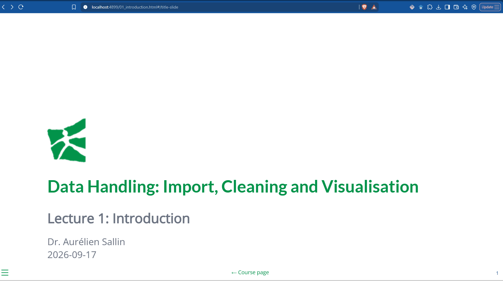

::: {.course-meta}
**BEcon 3230** · University of St.Gallen · Autumn Semester 2026

**Lecturer:** Dr. Aurélien Sallin — [aurelien.sallin@unisg.ch](mailto:aurelien.sallin@unisg.ch)<br>
**Teaching assistants:** Ana Armendariz Pacheco, Andrea Burro
:::

<!-- {.banner fig-alt="The data science pipeline: import, tidy, transform, visualise, model and communicate data."} -->

## Objectives

::: {.objectives}
By the end of the course, you will be able to...

- **Use essential tools for working with data.** We will work with the programming language R, but the concepts apply to any programming language.
- **Manage a data project from start to finish.** You will practice collecting, cleaning, and analysing data to carry out a complete project in Economics (research, consulting, ...).
- **Formulate meaningful questions from data.** You will learn how to explore datasets and identify relevant questions.
- **Communicate insights effectively.** You will gain experience in presenting results clearly and persuasively.
:::

## Schedule and Materials

| Date | Unit | Course Materials | Exercises |
|------|------|--------|-----------|
| 17.09.2026 | Introduction: Big Data / Data Science, course overview | [soon]{.soon} | [Handout](materialsExercises/01_tools_functions/exercises/01_tools_programming_handout.html)<br>[Slides](materialsExercises/01_tools_functions/exercises/01_tools_programming_slides.html) |

: {tbl-colwidths="[12,52,18,18]"}

::: {#using-the-slides .callout-note collapse="true" appearance="simple"}
## ⌨️ How to use the slides — shortcuts &amp; making a PDF

The slides are Quarto [reveal.js](https://quarto.org/docs/presentations/revealjs/) presentations. They open in your normal browser, no software to install.

**Getting around a deck:** <kbd>←</kbd><kbd>→</kbd> previous/next &nbsp;·&nbsp; <kbd>O</kbd>/<kbd>Esc</kbd> overview &nbsp;·&nbsp; <kbd>F</kbd> full screen &nbsp;·&nbsp; <kbd>S</kbd> speaker notes &nbsp;·&nbsp; <kbd>E</kbd> scroll view &nbsp;·&nbsp; <kbd>?</kbd> all shortcuts

**Making a PDF**

There is no separate PDF to download. To print one yourself:

1. Open the slides and add `?print-pdf` to the end of the address, then reload:

   ```
   .../01_introduction.html?print-pdf
   ```

2. Press <kbd>Ctrl</kbd>+<kbd>P</kbd> (<kbd>⌘</kbd>+<kbd>P</kbd> on a Mac).

3. In the print dialog set **Destination:** *Save as PDF*, **Layout:** *Landscape*, **Margins:** *None*, **Background graphics:** *on* (otherwise you get white boxes where the colours should be), then save.

{fig-alt="Screen recording: adding ?print-pdf to the slide address, opening the print dialog and saving the slides as a PDF."}

Use Chrome or Edge. Firefox and Safari do not honour the reveal.js print stylesheet and will give you one very long page instead of slides.
:::
