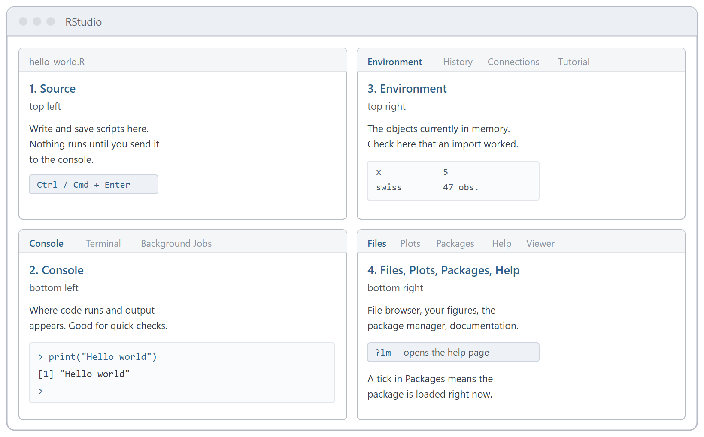

```{r}
#| label: setup
#| include: false
options(width = 100)
library(knitr)
```

**All course material:**
<https://github.com/ASallin/BEcon_3230_Datahandling_ImportCleaningandVisualization>

# Before we start

By the end of the session you should have:

- R and RStudio installed and running on your own laptop
- a course folder with an RStudio Project inside it
- your first R script, saved and running
- the packages we need for the rest of the course installed
- a working idea of what a path, an object and a package are

Read a section, then do the exercise that follows it. Type the code rather than copying
and pasting it. If something does not work, raise your hand.

| Part | What we do |
|------|------------------------------------------------|
| 1 | Install R and RStudio |
| 2 | The RStudio window, and R as a calculator |
| 3 | Folders, paths and an RStudio Project |
| 4 | Scripts |
| 5 | Objects, and the arrow `<-` |
| 6 | Packages |
| 7 | Quarto |
| Self-study | Vectors |

# Part 1. R and RStudio

R and RStudio are two separate programs.

**R** is the programming language and the engine that runs your code. It does the
computing.

**RStudio** is an *IDE*, an Integrated Development Environment: an editor for your
scripts, a pane for your plots, a help viewer, a file browser. RStudio does no
computing itself. Every time you run a line, RStudio hands it to R and shows you what R
sends back.

So: **install R first, RStudio second**, and once installed, you open **RStudio**, not R.

## Installing R

Go to <https://cran.r-project.org/> and pick your operating system.

**Windows.** Click *Download R for Windows*, then *base*, then the big link at the top,
*Download R-4.x.x for Windows*. Run the file and accept every default.

**macOS.** Click *Download R for macOS*, then choose the right file: the **arm64**
`.pkg` for Apple silicon (M1 to M4), the **x86_64** `.pkg` for older Intel Macs. If you
are not sure which you have, look under the Apple menu, *About This Mac*. Open the
`.pkg` and accept every default.

## Installing RStudio

Go to <https://posit.co/download/rstudio-desktop/> and download **RStudio Desktop**,
the free version. Install it with the defaults.

## When it does not work

| Problem | Fix |
|-----------------------------------|-------------------------------------------|
| RStudio opens but nothing runs, or it cannot find R | You installed only RStudio. Install R from CRAN, then restart RStudio |
| "R session failed to start" | Restart RStudio. If it persists, go to `Tools > Global Options > General` and point *R version* at your R installation |
| macOS: "cannot be opened because the developer cannot be verified" | Right-click the file and choose *Open*, or go to `System Settings > Privacy & Security` and click *Open Anyway* |
| Windows: your user name contains a space or an accent | R struggles with the path to your personal library. Ask me and we set a library path together |
| No admin rights on the laptop | Try installing "for this user only" |

::: {.callout-note}
## Exercise 1: get R running

1. Install R.
2. Install RStudio.
3. Open RStudio, click into the Console, type `R.version.string` and press Enter.

You should see something like `"R version 4.4.1 (2024-06-14)"`. Any version 4 is fine
for this course. If anything failed, tell me and we solve it together.
:::

# Part 2. The RStudio window

RStudio opens with four panes. Yours may be arranged slightly differently, and the
Source pane only appears once you open a script.

{width=100%}

**Source** (top left). Where you write and save scripts. Nothing here runs on its own.
You send a line to R with `Ctrl+Enter` (`Cmd+Enter` on Mac).

**Console** (bottom left). Where code runs and where output appears. Nothing typed here
is saved.

**Environment** (top right). The objects currently in memory. Look here to confirm that
an object really was created.

**Files / Plots / Packages / Help** (bottom right). A file browser, your figures, the
list of installed packages, and the documentation.

Two things to recognise in the Console. The prompt `>` means R is waiting for a
command. The prompt `+` means R thinks your command is unfinished, usually because you
left a bracket or a quotation mark open; press `Esc` to cancel the line and type it
again.

## R as a calculator

```{r}
2 + 2
20 / 8
2^3
sqrt(16)
round(3.14159, 2)
```

| Operator | Meaning | Example | Result |
|----|-----------------|-----------|------|
| `+` | addition | `7 + 3` | 10 |
| `-` | subtraction | `7 - 3` | 4 |
| `*` | multiplication | `7 * 3` | 21 |
| `/` | division | `7 / 3` | 2.333 |
| `^` | power | `7^2` | 49 |
| `%%` | remainder | `7 %% 3` | 1 |

Anything after a `#` on a line is a **comment**. R ignores it.

```{r}
# The area of a circle with radius 3
pi * 3^2
```

## Errors and warnings

You will produce a lot of errors. Read them.

```{r error=TRUE}
sqrt("four")
```

R is telling you what is wrong: `sqrt()` needs numbers and you gave it text. An
**error** means R stopped and did nothing. A **warning** means R did something and
wants you to know it was odd:

```{r warning=TRUE}
sqrt(-1)
```

## Getting help

Every command in R has a documentation page. Put a `?` in front of the name:

```{r eval=FALSE, purl=FALSE}
?round
```

The page opens in the Help pane. Start with the **Examples** at the bottom, which you
can copy into the Console and run. If you do not know the name you are looking for,
`??` searches the documentation, as in `??regression`.

::: {.callout-note}
## Exercise 2: the Console

Type each of these into the Console and press Enter.

1. `2 + 2`
2. `144 / 12`
3. `sqrt(81)`
4. `round(2.718281828, 3)`
5. `10 / 0`. Is this an error?
6. Type `sqrt(16` without the closing bracket and press Enter. Look at the prompt on
   the left, then press `Esc`.
7. Open the help page for `round()`.
:::

# Part 3. Folders, paths and the working directory

Most `cannot open file` errors come from R looking in the wrong folder.

A **directory** is a folder. Directories sit inside other directories and form a tree:

```
Documents
  2026_Data_Handling
    course
    exercises
      data
        swiss.csv
      code
        hello_world.R
```

A **path** is the address of a file or a folder. An **absolute path** starts at the top
of your disk and works from anywhere:

```
C:/Users/anna/Documents/2026_Data_Handling/exercises/data/swiss.csv     (Windows)
/Users/anna/Documents/2026_Data_Handling/exercises/data/swiss.csv       (Mac)
```

A **relative path** starts from wherever you currently are:

```
exercises/data/swiss.csv     swiss.csv, in the folder data, inside exercises
../swiss.csv                 swiss.csv, one folder up from here
```

Absolute paths break as soon as the folder moves, because nobody else has a folder
called `C:/Users/anna/`. **Use relative paths in your scripts.**

The **working directory** is where R currently is. Every relative path is read from it.

```{r eval=FALSE, purl=FALSE}
getwd()                                     # which folder am I in?
list.files()                                # what is in it?
setwd("C:/Users/anna/Documents/2026_Data_Handling")   # move somewhere else
```

Run `getwd()` and `list.files()` whenever R says a file does not exist. Usually the
file is there and you are in the wrong folder.

**On Windows, write paths with forward slashes** (`C:/Users/...`). A single backslash
has a special meaning in R and will cause errors.

## RStudio Projects

An **RStudio Project** is a folder with a small `.Rproj` file in it. When you open the
project, RStudio sets the working directory to that folder automatically, on any
computer, so your relative paths always work and you never need `setwd()`.

::: {.callout-note}
## Exercise 3: set up your course folder

1. In your file browser, create a folder called `2026_Data_Handling`, for example in
   Documents.
2. Inside it, create two subfolders, `course` and `exercises`.
3. Inside `exercises`, create two subfolders, `data` and `code`.
4. In RStudio, click the **Project** button in the top-right corner, choose
   **New Project... > Existing Directory**, browse to `2026_Data_Handling`, and click
   **Create Project**.
5. Check with `getwd()`. The path should end in `/2026_Data_Handling`.

`course` is for the lecture material, `exercises` for the exercise sessions. We use the
same structure in both.
:::

# Part 4. Scripts

Everything you type in the Console disappears when you close RStudio. A **script** is a
plain text file, ending in `.R`, that holds your code so you can save it, correct it and
run it again.

- `Ctrl+Enter` (`Cmd+Enter`) runs the current line, or the selected lines
- the **Run** button does the same
- `source("exercises/code/my_script.R")` runs a whole script from the Console

Writing a line in the Source pane does nothing until you send it to R.

::: {.callout-note}
## Exercise 4: your first script

1. In the Console, type `print("Hello world")` and press Enter.
2. Create a script with `File > New File > R Script`.
3. Type `print("Hello world")` on the first line.
4. Put the cursor on that line and press `Ctrl+Enter` (`Cmd+Enter`). Watch it appear in
   the Console and run.
5. Save the file into `exercises/code` as `hello_world.R`.
6. Back in the Console, run the saved file:

```{r eval=FALSE}
source("exercises/code/hello_world.R")
```

The path in step 6 is relative, and it works because the project set your working
directory for you.
:::

# Part 5. Objects, and the arrow `<-`

So far every result appeared on screen and was immediately forgotten. To keep a result,
give it a name. In R you do that with the arrow `<-`.

```{r}
x <- 5
```

Read it as "x gets 5". Nothing prints, which is normal: R stored the value instead of
showing it. `x` is now listed in the **Environment** pane. To see the value, type the
name:

```{r}
x
```

Anything with a name is an **object**, and objects can be used to build other objects:

```{r}
y <- 3
z <- x + y
z
```

`z` was computed once, from the values `x` and `y` had at that moment. Changing `x`
afterwards does not update `z`:

```{r}
x <- 100
z
```

Four things to know about names:

- **R overwrites without warning.** `x <- 100` silently replaced the 5.
- **Names are case sensitive.** `data`, `Data` and `DATA` are three different objects.
  Many `object not found` errors are a capital letter.
- **Names must start with a letter** and can contain letters, digits, `.` and `_`. No
  spaces and no accents: `2023_income` is not valid, `income_2023` is.
- **Use `<-`, not `=`.** Both work for assignment, but `=` also means something else in
  R. The shortcut `Alt+-` (`Option+-` on Mac) types the arrow for you.

Two commands to see and clear what is in memory:

```{r eval=FALSE, purl=FALSE}
ls()              # list the objects currently in memory
rm(list = ls())   # remove all of them
```

::: {.callout-note}
## Exercise 5: objects

1. Store your age in an object called `age`, and print it.
2. Create `radius <- 3`, then create `area` as $\pi r^2$ and round it to two decimals.
   `pi` already exists in R.
3. Type `Age`, with a capital A. What happens, and why?
:::

::: {.callout-tip collapse="true"}
## Solution to Exercise 5

```{r}
age <- 27
age

radius <- 3
area <- pi * radius^2
round(area, 2)
```

```{r error=TRUE}
Age
```

`Age` does not exist. You created `age`. Names are case sensitive.
:::

# Part 6. Packages

Base R gives you the language and a great deal of statistics. Most of what makes R
useful for data work sits in **packages**: collections of commands written by other
people and published on CRAN, the official archive. In this course you will use three:
`dplyr` for handling data, `ggplot2` for graphics, and `readxl` for reading Excel files.

Two commands, and they do different things:

```{r eval=FALSE, purl=FALSE}
install.packages("dplyr")   # download and install: ONCE per computer
library(dplyr)              # load into this session: EVERY time you open R
```

`install.packages()` downloads the package from CRAN and copies it onto your hard disk.
You do it once. Note the quotation marks around the name.

`library()` makes an installed package available in the session you are working in
right now. You do it every time you open R. Note that here there are no quotation
marks.

**Install once, load every session.** If you reopen RStudio tomorrow and your commands
seem to have vanished, nothing is broken and nothing needs reinstalling. Run `library()`
again.

Two things to watch for while installing. If R asks *"Do you want to install from
sources the package which needs compilation?"*, answer `n` and press Enter. And when you
load `dplyr`, you get a message about objects being masked from `package:stats`. This is
information, not an error.

| Message | Meaning |
|-------------------------------------|-----------------------------------|
| `there is no package called 'dplyr'` | Not installed. Run `install.packages("dplyr")` |
| `could not find function "filter"` | Installed but not loaded. Run `library(dplyr)` |
| `package 'dplyr' was built under R version ...` | A warning, not an error. Usually harmless |

::: {.callout-note}
## Exercise 6: packages

1. Install the three course packages:

```{r eval=FALSE, purl=FALSE}
install.packages(c("dplyr", "ggplot2", "readxl"))
```

2. Load them:

```{r eval=FALSE, purl=FALSE}
library(dplyr)
library(ggplot2)
library(readxl)
```

3. Open the Packages tab, bottom right. Find `dplyr` in the list. Is it ticked?
4. Restart R with `Ctrl+Shift+F10`, then run `ggplot()`. What happens, and what do you
   have to do about it?
:::

::: {.callout-tip collapse="true"}
## Solution to Exercise 6, point 4

Restarting R unloads every package, so `ggplot()` now gives
`could not find function "ggplot"`. You do not reinstall anything. You run
`library(ggplot2)` again. This is why every script starts with its `library()` calls.
:::

# Part 7. Quarto

The `.qmd` files in the course repository, including this handout, are **Quarto**
documents: plain text in which you mix normal writing with executable R code chunks.
Rendering the document runs the code and drops the results, tables and plots straight
into the finished PDF or HTML. Nothing is copied by hand from R into Word, so the table
and the data cannot disagree.

Have a look: `File > New File > Quarto Document...`, accept the defaults, and click
**Render**. The first time, RStudio asks to install a couple of supporting packages; say
yes. We come back to Quarto later in the course.

# Self-study: vectors

We come back to vectors in week 3. Read this part at home if you want a head start.

An object can hold several values at once. You build one with `c()`, for "combine":

```{r}
income <- c(52000, 48000, 61000, 55000, 49000)
income
```

This is a **vector**: an ordered set of values of the same type, and a column of a data
set is exactly this. Vectors can hold text too, in which case each value goes in
quotation marks:

```{r}
canton <- c("SG", "ZH", "BE", "SG", "VD")
canton
```

Useful things to ask about a vector:

```{r}
length(income)   # how many values
mean(income)     # their average
```

::: {.callout-note}
## Exercise 7: vectors

1. Create a vector `grades` holding 4.5, 5, 5.5, 4 and 6.
2. How many values does it have? What is the average?
:::

::: {.callout-tip collapse="true"}
## Solution to Exercise 7

```{r}
grades <- c(4.5, 5, 5.5, 4, 6)
length(grades)
mean(grades)
```
:::

# Reference

| Action | Windows | Mac |
|---|---|---|
| Run current line | `Ctrl+Enter` | `Cmd+Enter` |
| Run whole script | `Ctrl+Shift+Enter` | `Cmd+Shift+Enter` |
| New R script | `Ctrl+Shift+N` | `Cmd+Shift+N` |
| Save | `Ctrl+S` | `Cmd+S` |
| Insert `<-` | `Alt+-` | `Option+-` |
| Comment out lines | `Ctrl+Shift+C` | `Cmd+Shift+C` |
| Restart R | `Ctrl+Shift+F10` | `Cmd+Shift+F10` |
| Stop running code | `Esc` | `Esc` |

| Command | What it does |
|---|---|
| `?name` | opens the help page for `name` |
| `??word` | searches the documentation for `word` |
| `ls()` | lists the objects in memory |
| `rm(list = ls())` | clears them |
| `getwd()` | where you are |
| `list.files()` | what is in the current folder |
| `install.packages("pkg")` | installs a package, once per machine |
| `library(pkg)` | loads a package, every session |
| `R.version.string` | which version of R you are running |
