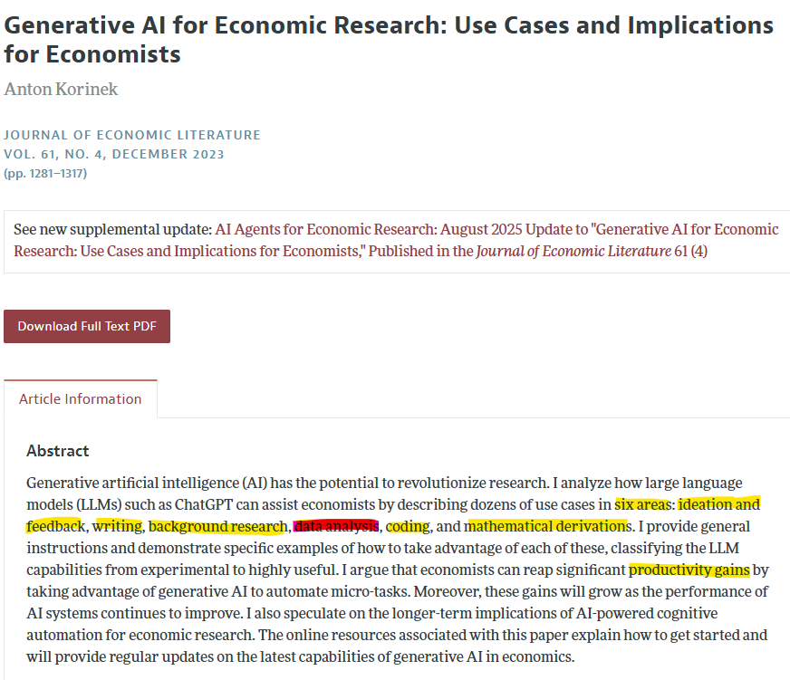
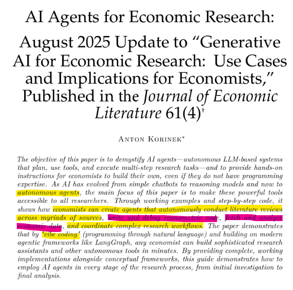
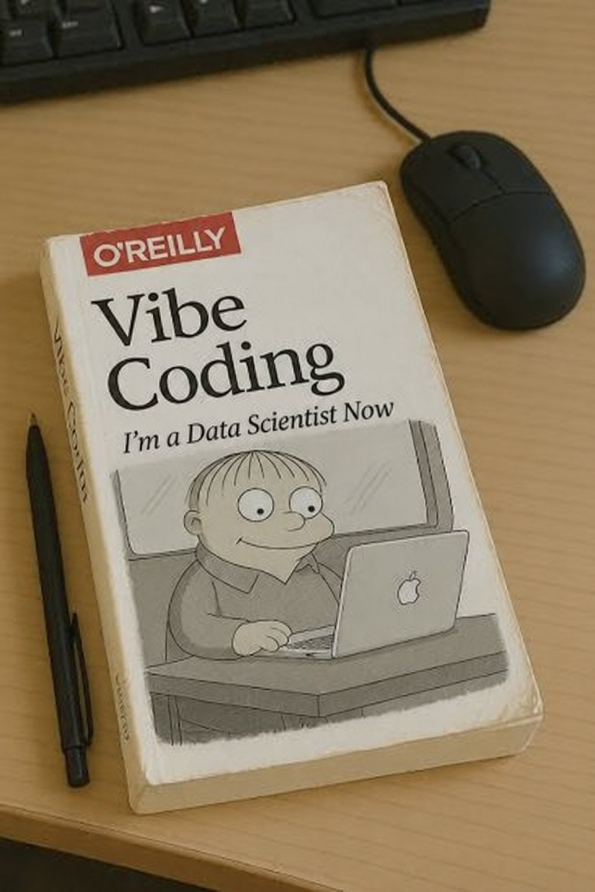
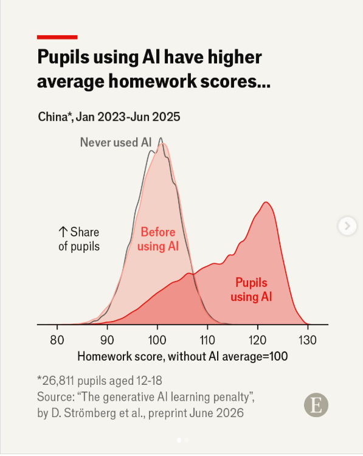
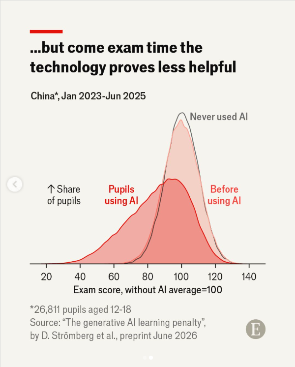
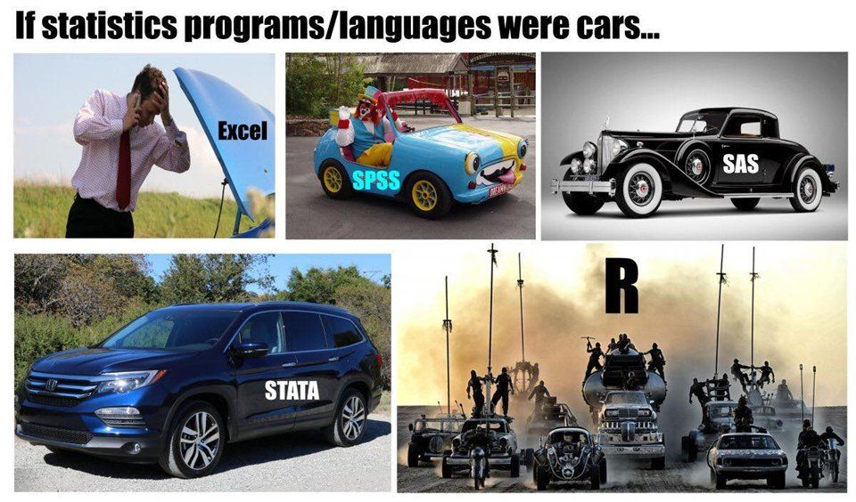

```{r set-options, echo=FALSE, cache=FALSE, warning=FALSE}
options(width = 100)
library(knitr)
library(purrr)
```


# Welcome to Data Handling 2026!

## Introduce yourself!

- Go to this app (use the QR code): [https://datahandling.shinyapps.io/form/](https://datahandling.shinyapps.io/form/)

```{r , echo=FALSE, out.width = "35%", fig.align='center', purl=FALSE}

```

##

```{r , echo=FALSE, out.width = "85%", fig.align='center', purl=FALSE}
include_graphics("../../img/ds1.png")
```


##

```{r , echo=FALSE, out.width = "85%", fig.align='center', purl=FALSE}
include_graphics("../../img/ds2.png")
```


##

```{r , echo=FALSE, out.width = "85%", fig.align='center', purl=FALSE}
include_graphics("../../img/ds3.png")
```


##

```{r , echo=FALSE, out.width = "85%", fig.align='center', purl=FALSE}
include_graphics("../../img/ds4.png")
```


##

```{r , echo=FALSE, out.width = "85%", fig.align='center', purl=FALSE}
include_graphics("../../img/ds5.png")
```


##

```{r , echo=FALSE, out.width = "85%", fig.align='center', purl=FALSE}
include_graphics("../../img/ds6.png")
```


##

```{r , echo=FALSE, out.width = "85%", fig.align='center', purl=FALSE}
include_graphics("../../img/ds7.png")
```


##

```{r , echo=FALSE, out.width = "85%", fig.align='center', purl=FALSE}
include_graphics("../../img/ds8.png")
```


##

```{r , echo=FALSE, out.width = "85%", fig.align='center', purl=FALSE}
include_graphics("../../img/ds9.png")
```


##

```{r , echo=FALSE, out.width = "85%", fig.align='center', purl=FALSE}
include_graphics("../../img/ds10.png")
```


##

```{r , echo=FALSE, out.width = "85%", fig.align='center', purl=FALSE}
include_graphics("../../img/ds11.png")
```


##

```{r , echo=FALSE, out.width = "85%", fig.align='center', purl=FALSE}
include_graphics("../../img/ds12.png")
```


##

```{r , echo=FALSE, out.width = "85%", fig.align='center', purl=FALSE}
include_graphics("../../img/ds13.png")
```


##

```{r , echo=FALSE, out.width = "85%", fig.align='center', purl=FALSE}
include_graphics("../../img/ds14.png")
```


##

```{r , echo=FALSE, out.width = "85%", fig.align='center', purl=FALSE}
include_graphics("../../img/data_science_pipeline.png")
```


# Background

## Data Science?

<br>

*"This coupling of scientific discovery and practice involves the **collection, management, processing, analysis, visualization, and interpretation of vast amounts of heterogeneous data** associated with a diverse array of scientific, translational, and inter-disciplinary applications."*

University of Michigan 'Data Science Initiative', 2015


## But, what about statistics?!

<br>

*"Seemingly, statistics is being marginalized here; the implicit message is that statistics is a part of what goes on in data science but not a very big part. At the same time, many of the concrete descriptions of [data science] will seem to statisticians to be bread-and-butter statistics. <br> **Statistics is apparently the word that dare not speak its name in connection with such an initiative!**"*

David Donoho (2015). __50 years of Data Science__


## What's new about all this?

*"All in all, I have come to feel that my central interest is in data analysis, which I take to include, among other things: ..."*


## What's new about all this?

*"All in all, I have come to feel that my central interest is in data analysis, which I take to include, among other things:*

  - *procedures for analyzing data,*
  - *techniques for interpreting the results of such procedures,*
  - *ways of planning the gathering of data to make its analysis easier, more precise or more accurate,*
  - *and all the machinery and results of (mathematical) statistics which apply to analyzing data."*


## What's new about all this?

```{r tukey1, echo=FALSE, out.width = "35%", fig.align='center', purl=FALSE}
include_graphics("../../img/tukey.jpg")
```

John Tukey (*The Future of Data Analysis*, 1962)


## Technological change

```{r computers, echo=FALSE, out.width = "80%", fig.align='center', purl=FALSE}
include_graphics("../../img/computers.jpg")
```


## Relevance for modern economic research

```{r css, echo=FALSE, out.width = "80%", fig.align='center',  purl=FALSE}
include_graphics("../../img/css.png")
```


## Relevance for modern economic research

```{r internet, echo=FALSE, out.width = "90%", fig.align='center',  purl=FALSE}
include_graphics("../../img/internet.png")
```


## Relevance for modern economic research

```{r bigdata, echo=FALSE, out.width = "80%", fig.align='center',  purl=FALSE}
include_graphics("../../img/bigdata.png")
```


## Relevance for modern economic research

```{r text, echo=FALSE, out.width = "80%", fig.align='center',  purl=FALSE}
include_graphics("../../img/text.png")
```


## Relevance for modern economic research

:::: {.columns}

::: {.column width="50%"}
```{r genai1, echo=FALSE, out.width = "100%", fig.align='center',  purl=FALSE}

```
:::

::: {.column width="50%"}
```{r genai2, echo=FALSE, out.width = "90%", fig.align='center',  purl=FALSE}

```
:::

::::


## Data science in Economics skill set

```{r venn, echo=FALSE, out.width = "50%", fig.align='center',  purl=FALSE}
include_graphics("../../img/venn_diagramm.png")
```


## Data science as a life skill

```{r sexy, echo=FALSE, out.width = "80%", fig.align='center',  purl=FALSE}
include_graphics("../../img/datascientistsexy.png")
```


## Data science as a life skill

"More than anything, what data scientists do is **make discoveries while swimming in data.** ...  As they make discoveries, they communicate what they’ve learned and suggest its implications for new business directions. Often they are **creative in displaying information visually and making the patterns they find clear and compelling**...

They advise executives and product managers on the implications of the data for *products, processes, and decisions*.

What kind of person does all this? [Think of him or her as a hybrid of data hacker, analyst, communicator, and trusted adviser. The combination is extremely powerful — and rare.]{.accent-bold}"


## Data science in 2026: past its golden age?

Between 2014 and 2021, data scientists saw unprecedented career and salary growth, fueled by the explosion of big data and artificial intelligence.

  ➡️ Yet many “data science” projects never reached production or had little impact.

2022: LLMs made some of the tasks of data scientists obsolete. The importance of coding skills has become less important.

<br>

[**Or so it seems...**]{.accent-bold}


## Why are we still learning programming in 2026?

- Have more fun: AI has made **learning to code more enjoyable**: flatter learning curve for beginners -> higher returns on effort investment at the beginning -> not stuck
- Develop mastery. Everyone can code with AI. But: A data scientist is someone who has developed skills, flair for data, creativity, and solid fundamentals.
- Learn a **mindset for data analysis and problem solving**: solution-oriented and pragmatism, communication and story-telling, algorithmic thinking, debugging and patience with mistakes, attention to detail, etc.
- Speak the language you need to **prompt LLMs efficiently**.


## Learning programming in the age of vibe coding

```{r vibecoding, echo=FALSE, out.width = "80%", fig.align='center',  purl=FALSE}

```

Vibe coding generally implies **delegating a substantial part of the implementation and reasoning to the AI**, with the human steering through high-level instructions and testing the results.


## {class="inverse" background-image="../../img/break-picture.png" background-size="100%" background-repeat="cover"}


# Vision for this course


## {class="inverse" background-image="../../img/mechanics.webp" background-size="100%" background-repeat="cover"}


## By the end of the course, you will be able to...

- [**Use essential tools for working with data**]{.green-bold} <br> We will work with the programming language R, but the concepts apply to any programming language.
- [**Manage a data project from start to finish**]{.green-bold} <br> You will practice collecting, cleaning, and analyzing data to carry out a complete project in Economics (research, consulting, ...).
- [**Formulate meaningful questions from data**]{.green-bold} <br> You will learn how to explore datasets and identify relevant questions.
- [**Communicate insights effectively**]{.green-bold} <br> You will gain experience in presenting results clearly and persuasively.


## My commitment to these goals and to your learning process

- **Transferrable skills**
- **Hands-on approach**
- **Emphasis on real-world relevance** <br>(caveat: this course is mandatory for Econ students, I have limited freedom in the syllabus)
- **As much fun as possible (as coding can be fun...😎)**


## Your commitment to the course <br>&nbsp;

- Prepare with reading, visit the lecture, recap key concepts in lecture notes (self-study)
- Work on exercises, come to exercise session, tackle the tricky exercises together!
- Code, code, and code. Repeat...
- 🤖 Use AI as a learning companion and sparring partner, not as a crutch 🩼! (more on that later)

```{r}
try <- 0
while(try < 999) {
  try <- try + 1
}
cat("success!")
```


## Our Team - At Your Service

<br>

<div class="custom-table">

|                      |                             |                             |
|----------------------|-----------------------------|-----------------------------|
|  |   |  |
| Ana Armendariz Pacheco     | Andrea Burro                 | Aurélien Sallin |

</div>
<style>
.custom-table table th {
    width: 20%;
    border-top: 0px;
    border-bottom: 0px;
}
.custom-table table thead th {
    border-top: 0px;
    border-bottom: 0px;
}
.custom-table thead th, .custom-table tr:nth-child(1) {
    background-color: white;
}
</style>


## Your instructor - Aurélien Sallin

##### Experience

::: {style="font-size: 0.9em;"}
- 2022-today: Senior Health Economist,  SWICA Healthcare Organization
- 2022-today: Lecturer, HSG
- 2017-2022: Research Associate, Swiss Institute for Empirical Economic Research (SEW-HSG)
:::

##### Education

::: {style="font-size: 0.9em;"}
- 2018-2022: PhD Economic and Finance, HSG (Lund and Federal Reserve)
- 2018: MA in Philosophy, Fribourg
- 2017: MA in Economics, Fribourg
:::


 &nbsp;&nbsp;
 &nbsp;&nbsp;
 &nbsp;&nbsp;
 &nbsp;&nbsp;


## Your instructor - Aurélien Sallin

##### Research at SWICA

 - Evaluate effects of insurance products on health care consumption, costs, and medical behaviors
 - Use Real-World Data from claims to assess effectiveness of health technological tools
 - Use (Causal) Machine Learning to evaluate the effect of health policies on doctors' prescription behaviors
 - Develop financing models for mandatory health care in Switzerland

<div style="height: 10px;"></div>

##### Other Research

 - Missclassification rates for gifted students
 - Evaluation of Special Education programs


# Organisation of the Course

## Course concept: lectures

#### Weekly plenary sessions

  - Background/Concepts
  - Illustration of concepts
  - Illustration of 'hands-on' approaches
  - We will alternate between front-of-class teaching and coding tasks. When coding, code along or just watch 🥸
  - Interactive, questions encouraged.


## Course concept: exercises

#### Exercise sessions (bi-weekly evening sessions)

  - Discussion of exercises and additional input with Ana and Andrea
  - Recap of concepts; Hands-on exercises/tutorials in R; Q&A, support

\

##### Important information:  We will conduct only one exercise session in plenary.
  - Part 1: 17/09/2026, 01/10/2026, 15/10/2026, 4:15pm-6:00pm, with **Ana**, **room 01-011**
  - Part 2: 12/11/2026, 26/11/2026, 10/12/2026, 4:15pm-6:00pm, with **Andrea**, **room 01-011**

# The road ahead

## {class="inverse" background-image="../../img/roadahead2.jpg" background-size="100%" background-repeat="cover"}


## Part I: Data (Science) fundamentals

::: {style="font-size: 0.85em;"}

```{r echo = FALSE, warning=FALSE}
library(readxl)
library(knitr)
library(magrittr)
library(kableExtra)

sched <- read_xlsx("../../schedule2026.xlsx") |>
    dplyr::mutate(
        Lecturer = dplyr::case_when(
            Lecturer == "Aurélien Sallin" ~ "Aurélien",
            Lecturer == "Ana Armendariz Pacheco" ~ "Ana",
            Lecturer == "Andrea Burro" ~ "Andrea",
            Lecturer == "Minna Heim" ~ "Minna Heim",
            Lecturer == "Aurélien Sallin, Minna Heim" ~ "Aurélien, Minna Heim",
            Lecturer == "Federica Mascolo" ~ "Federica",
            is.na(Lecturer) ~ "",
        )
    ) |>
     dplyr::mutate(
        Date = ifelse(is.na(Date), "", as.character(Date))
     )

tab <- sched[c(1:6, 8:9), c(1, 5, 6)] |>
    dplyr::select(everything())

colnames(tab) <- c("Date", "Topic", "Lecturer")

tab |>
    kable(format = "html") |>
    kable_styling(full_width = T) |>
    column_spec(1, width = "200px") |>
    column_spec(2, width = "800px") |>
    column_spec(3, width = "300px") |>
    row_spec(c(1, 3, 4, 6, 7), bold = T, color = "green") |>
    row_spec(
      c(2, 3, 5, 7, 8), # larger vertical space
      extra_css = "border-bottom: 20px solid white;"
    ) |>
    row_spec(c(1, 4, 6, 7), extra_css = "border-bottom: 0px solid white;") # smaller vertical space
```

:::

## Part I: Data (Science) fundamentals

<br>

```{r, echo=FALSE}
tab <- sched[10, c(1, 5, 6)] |>
    dplyr::select(everything())

colnames(tab) <- c("Date", "Topic", "Lecturer")

tab |>
    kable(format = "html") |>
    kable_styling(full_width = T) |>
    column_spec(1, width = "200px") |>
    column_spec(2, width = "800px") |>
    column_spec(3, width = "300px") |>
    row_spec(c(1), bold = T, color = "green") |>
    row_spec(c(1), extra_css = "border-bottom: 25px solid white;")
```

**Special lecture** with **Minna Heim**, BEcon HSG, MA in Data Science at ETH Zurich


## Part II: Data gathering and preparation

```{r, echo=FALSE}
tab <- sched[11:17, c(1, 5, 6)] |>
    dplyr::select(everything())

colnames(tab) <- c("Date", "Topic", "Lecturer")

tab |>
    kable(format = "html") |>
    kable_styling(full_width = T) |>
    column_spec(1, width = "200px") |>
    column_spec(2, width = "800px") |>
    column_spec(3, width = "300px") |>
    row_spec(c(1), bold = T, color = "firebrick4") |>
    row_spec(c(4,  7), bold = T, color = "green") |>
    row_spec(c(1, 3, 6), extra_css = "border-bottom: 25px solid white;") |>
    row_spec(c(2, 4, 5), extra_css = "border-bottom: 0px solid white;")
```


## Part III: Analysis, visualisation, output

```{r, echo=FALSE}
tab <- sched[18:nrow(sched), c(1, 5, 6)] |>
    dplyr::select(everything())

colnames(tab) <- c("Date", "Topic", "Lecturer")

tab |>
    kable(format = "html") |>
    kable_styling(full_width = T) |>
    column_spec(1, width = "200px") |>
    column_spec(2, width = "800px") |>
    column_spec(3, width = "300px") |>
    row_spec(c(1, 3, 4), bold = T, color = "green") |>
    row_spec(c(6), bold = T, color = "firebrick4") |>
    row_spec(c(3, 5), extra_css = "border-bottom: 25px solid white;") |>
    row_spec(c(1, 2, 4), extra_css = "border-bottom: 0px solid white;")
```


## Exam information

The examination consists of two parts:

- [Group written project]{.green-bold}, 50% of final grade.
- [Decentral written examination]{.green-bold}, 50% of final grade.


## Exam information: group project

#### Goals
Use real-world data in a project to practice and reinforce the concepts covered in the course.

#### Project timeline

- **October 22**: Release of the project. Deadline for group formation (5 students per group). Groups must be registered on Canvas.
- **November 12**: Q&A session for the project.
- **December 16, 23:59**: Final submission.


## Written examination

#### Goals
Demonstrate your understanding of the concepts and practical applications covered in the course and in the group project beyond the use of LLMs.


#### Important information

- **December 17th, 2026**: Decentral written examination (**digital, BYOD**).
- Multiple choice questions (Multiple Choice; True False; Only one Correct) on the course content and on the group project.
- Essay questions on the group project.
- Duration: 60mn.


## Written examination

#### What to expect
- We will release samples of multiple choice questions in the lecture and via Quizzes on Canvas(exact same format and style of exam questions).
- We will release a mock exam during the break.


# The tools

## Core course resources

- All the necessary information and resources are available on Canvas.
- This year, all course materials (slides, code, data) are pushed on the following page: [https://aureliensallin.ch/BEcon_3230_Datahandling_ImportCleaningandVisualization/](https://aureliensallin.ch/BEcon_3230_Datahandling_ImportCleaningandVisualization/)
- Slides are made available in `html` format (Quarto slides). You can easily convert them to PDF. Instructions are provided in the course materials and Canvas.


## New evidence on AI and learning


:::: {.columns}

::: {.column width="50%"}
```{r ai1, echo=FALSE, out.width = "50%", fig.align='center',  purl=FALSE}

```
:::

::: {.column width="50%"}
```{r ai2, echo=FALSE, out.width = "50%", fig.align='center',  purl=FALSE}

```
:::

::::

"Does AI stop children from learning?" Stromberg et al. (2026): From Homework Illusion to Exam Penalty


## Why R?

##### *The* data language

::: {style="font-size: 0.85em;"}
- Widely used in Data Science jobs.
- Originally designed as a tool for statistical analysis.
- Particularly useful to program with data.
:::


##### High-level language

::: {style="font-size: 0.85em;"}
- Relatively easy to learn.
- A lot of free tutorials and support online.
:::


##### Free, open-source, large community

::: {style="font-size: 0.85em;"}
- Used in various fields.
- Thousands of 'R-packages' covering diverse aspects of data analysis.
- Learn from open sources.
:::


::: {.notes}
**Short history**

- Early 1990s: **Ross Ihaka and Robert Gentleman** (University of Auckland) write R as a free implementation inspired by S, for teaching statistics. The name: their first initials, and a nod to S.
- 1995: released as free software (GNU GPL). 1997: CRAN starts. 29 February 2000: R 1.0.0.
- 2011: RStudio IDE. 2010s: tidyverse (Hadley Wickham), ggplot2, R Markdown. 2022: RStudio the company becomes Posit, Quarto appears (these slides are made with it).
- Today: more than 20,000 packages on CRAN.

**Advantages, in more depth**

- Built by statisticians for data: data frames, missing values (`NA`) and vectorised operations are part of the language, not add-ons.
- Economics fits well: regressions, panel data, time series, fast fixed-effects estimation (`fixest`), regression tables (`modelsummary`). New econometric methods often come out as an R package first.
- Graphics: ggplot2 is still the reference for publication-quality plots.
- Reproducibility: code, results and text in one document (Quarto), so a report or paper can be re-run from the raw data.
- Free: no licence, unlike Stata or MATLAB. You keep using it after you leave HSG.
- R vs Python: not a war. Python is stronger for general programming and machine learning, R for statistics and data analysis.
- Honest caveats: R has quirks (several ways to do the same thing), and it can be slow or memory-hungry on very large data unless you use the right tools (`data.table`, `arrow`, `duckdb`).
:::

## R!
```{r echo=FALSE, fig.align='center', out.width="30%"}



```


## R

```{r echo=FALSE, out.width = "40%", fig.align='center', purl=FALSE}
include_graphics("../../img/R_logo.svg.png")
```


Install R from [here](https://stat.ethz.ch/CRAN/)!


## RStudio

```{r echo=FALSE, fig.align='center', out.width="30%"}

include_graphics("../../img/rstudio.png")

```
Install RStudio from [here](https://www.rstudio.com/products/rstudio/download/#download)!


## Main textbooks

- [Data Handling Pocket Reference](https://umatter.github.io/datahandling/)
- [Murrell, Paul (2009). *Introduction to Data Technologies*, London: Chapman & Hall/CRC.](https://www.stat.auckland.ac.nz/~paul/ItDT/)
- [Wickham, Hadley and Garred Grolemund (2017). *R for Data Science*, 1st Edition. Sebastopol, CA: O’Reilly.](http://r4ds.had.co.nz/)
- [Baumer, Kaplan and Norton (2023). *Modern Data Science with R*, 2nd Edition. ](https://mdsr-book.github.io/mdsr3e/)


## Further resources

- [Stackoverflow](https://stackoverflow.com/questions)
- [Get inspired in the R blogsphere](https://www.r-bloggers.com)
- ChatGPT


# How to best use AI for this course

<br>

## 1. Use AI as your Learning Companion

:::: {.columns}
::: {.column width="55%"}
❌ Ask AI to write full programs for you

✅ Ask **structured questions** based on your own knowledge (idea: knowledge reinforcement)

✅ Use AI to explore unknown and new approaches

:::
::: {.column width="45%"}

You want to compute the mean of each element of the list `x`.

```{r}
x <- list(
  c(1,2,3),
  c(4,5,6)
  )
```

- **Ask AI**:
“I know that the function to compute the mean is `mean()`, and I know that it takes atomic vectors as argument. How do I apply the mean to each vector in the list? Give me two options, and explain pros/cons?”
:::
::::


## 2. Use AI to better understand your code

:::: {.columns}
::: {.column width="55%"}

✅ Use AI as a translator

✅ Ask for explanations in plain language

✅ Get step-by-step descriptions

:::
::: {.column width="45%"}

You have the following piece of code:

```{r}
mat <- matrix(c(1,2,3, 11,12,13), nrow = 2, ncol = 3,
             byrow = TRUE,
             dimnames = list(c("row1", "row2"),
                             c("C.1", "C.2", "C.3")))
mat[1,] <- mat[1, ] + 10
mat[1,] == mat[2,]
```

**Ask AI**:
“Explain line by line what this R code does in plain English. What does the option `byrow = TRUE` do?”
:::
::::


## 3. Use AI to debug

:::: {.columns}
::: {.column width="55%"}

✅ Share error messages and context

✅ Ask for possible causes

✅ Ask for alternative solutions

:::
::: {.column width="45%"}

You try:

```r
log("text")
```

R sends the following error message: "non-numeric argument to mathematical function"

**Ask AI**:
“Why does this error occur in R and how can I fix it?”
:::
::::


## 4. Use AI as your Motivational Coach 🔥

:::: {.columns}
::: {.column width="55%"}
✅ Ask for tips to stay motivated and understand **WHY** you're learning what you're learning

✅ Ask for ways to make coding more enjoyable and directly relevant to your goals

✅ Ask for ways to make your code and thinking process more like the product of experts

:::
::: {.column width="45%"}
You don't see the point of learning to code functions and loops since AI can do it for you.

**Ask AI**:
“Why is learning to program functions important for an economist/data scientist? Give me some real-life examples. ”
:::
::::

# Questions?

##

<br><br>

::: {style="text-align: center; font-size: 0.7em;"}
[👈 Back to the Course page](https://aureliensallin.ch/BEcon_3230_Datahandling_ImportCleaningandVisualization/)
:::
